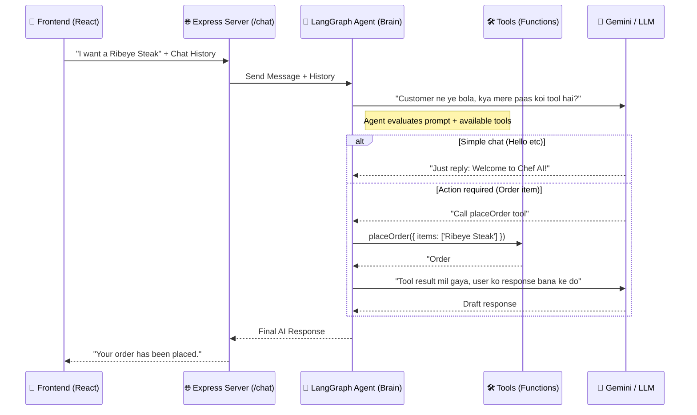

# 🏛️ AI Agent Architecture (Project Guide)

Aapka AI Agent based project **3 main components** me divide hota hai:

1. **The User (Client / Frontend)**  
   React application jahan user interact karta hai.

2. **The Server (Backend)**  
   Express.js API jo requests handle karta hai.

3. **The Brain (AI Agent)**  
   LangChain / LangGraph + LLM + Tools jo decision leta hai.

---

# 🔄 Interaction Flow (High Level)

Ek normal interaction kuch is tarah hota hai:



---

# ⚙️ Step-by-Step Workflow

## Step 1 — Trigger (User Message)

User frontend me message type karta hai.

Example:

```
What is today's lunch?
```

Frontend request bhejta hai:

```
POST /chat
```

Express route receive karta hai:

```javascript
const result = await agent.invoke({
  messages: [...]
})
```

Yaha se message **AI Agent ko pass hota hai**.

---

# Step 2 — AI Instructions (System Prompt)

Agent ka behaviour **System Prompt** define karta hai.

File location:

```
config/agent.js
```

Example system prompt:

```
"You are Chef AI, a friendly and professional restaurant assistant..."
```

System Prompt decide karta hai:

- AI ka role kya hai
- AI ka tone kya hoga
- AI kya kar sakta hai

---

# Step 3 — LLM Engine (Brain Power)

Agent ke andar ek **LLM model** hota hai.

Example file:

```
config/model.js
```

Aapne use kiya hai:

```
ChatGoogleGenerativeAI (Gemini)
```

LLM read karta hai:

- System Prompt
- Current user message
- Previous chat history

Fir decision banata hai.

---

# Step 4 — Decision Making (Tools Use karna hai ya nahi)

Yeh **Agentic AI ka sabse important part** hai.

Agent ke paas tools ka array hota hai.

```
tools/index.js
```

LLM sochta hai:

```
"Kya mujhe external data chahiye?"
```

### Case 1 — Simple Chat

User:

```
Hi
```

LLM response:

```
Hello! Welcome to Chef AI.
```

### Case 2 — Action Required

User:

```
Show me vegan menu
```

LLM decide karega:

```
Use getRecommendation tool
```

Tool call example:

```javascript
getRecommendation({
  diet: "vegan"
})
```

---

# Step 5 — Tool Execution

LangChain / LangGraph automatically tool call karta hai.

Example tool file:

```
tools/recommendationTool.js
```

Tool kya karta hai:

- Database call
- API call
- File read

Example data source:

```
data/menu.js
```

Tool output example:

```json
{
  "items": ["Pancakes", "Salad"]
}
```

---

# Step 6 — Final AI Response

Tool ka raw result AI Agent ko wapas milta hai.

Example raw result:

```
["Pancakes", "Salad"]
```

LLM is data ko convert karta hai **natural language response** me.

Example final response:

```
Here are some vegan options for you:
- Pancakes
- Salad
```

Fir Express API user ko response bhej deta hai.

---

# 🚀 Future me AI Agent banate waqt 3 Golden Rules

## 1️⃣ Keep Tools Simple

Har tool **sirf ek kaam kare**.

❌ Bad Example

```
placeOrderAndPayment()
```

✅ Good Example

```
placeOrder()
processPayment()
```

---

## 2️⃣ Tool Descriptions Matter

Tool parameters me **accurate descriptions** likho.

LLM description padh ke samajhta hai ki kya pass karna hai.

Example:

```javascript
z.object({
  diet: z.string().describe("Diet type like vegan, vegetarian, keto")
})
```

---

## 3️⃣ Memory is Mandatory

AI ko **chat history** chahiye hoti hai.

Isliye frontend se **previous messages** bhejna zaroori hai.

Example frontend file:

```
ChatInterface.jsx
```

Example chat history:

```javascript
[
  { role: "user", content: "Hi" },
  { role: "assistant", content: "Hello!" },
  { role: "user", content: "Show vegan menu" }
]
```

Isse AI context samajh pata hai.

---

# ✅ Final Conclusion

Aapka architecture already **modern AI Agent architecture** follow karta hai:

```
Frontend → Express Server → LangChain Agent → Tools → LLM → Response
```

Yeh structure **production AI systems** me bhi use hota hai.

Examples:

- AI customer support bots
- AI assistants
- AI ordering systems
- AI copilots